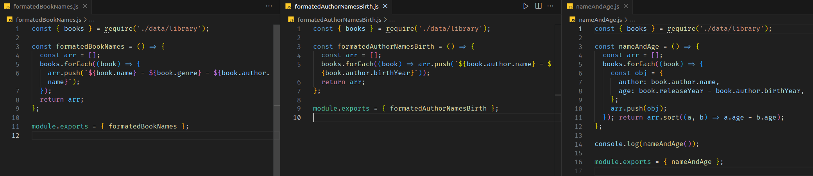

# README: Books list



## Project Description

This is my first time using higher-order functions. Here, I've written functions that interact with an array and return formatted data.

### Technologies

- LINUX
- VSCODE
- JAVASCRIPT

### What I Learned

- How to use HOFs, like forEach and sort
- How to create new arrays with formatted data

## How to Run the Project

1. Clone the repository:

   ```bash
   git clone https://github.com/feduarte-dev/books-list
   ```

2. Navigate to the project directory:

   ```bash
   cd your-repository
   ```

3. Install dependencies:

   ```bash
   npm install
   ```

4. Test the application:

   ```bash
   npm run test
   ```

## Contributions

[Felipe](https://www.linkedin.com/in/feduarte-dev/) - formatedAuthorNamesBirth.js - formatedBookNames.js - nameAndAge.js


[Trybe](https://www.betrybe.com/) - Everything else
